# Ksiegarnia

## Spis treści
1. [Specyfikacja wymagań systemowych](#1specyfikacja-wymagań-systemowych)
    1. [Cel systemu](#cel_systemu),
    2. [Wymagania funkcjonalne](#wymagania_funkcjonalne),
    3. [Wymagania niefunkcjonalne](#wymagania_niefunkcjonalne),
2. [Dokumentacja techniczna](#2dokumentacja_techniczna)
    * [Architektura](#architektura)
    * [Instalacja środowiska developerskiego](#instalacja-środowiska-developerskiego)
    * [Struktura bazy danych](#struktura-bazy-danych)
    * [Rejestracja](#rejsetracja)
    * [Logowanie](#logowanie)
    * [Kod](#kod)
        * [Server](#server)
        * [Utils](#utils)
        * [SeedRouter](#seedrouter)
        * [ProductRouter](#productrouter)
        * [UserRouter](#userrouter)
        * [OrderRouter](#orderrouter)
        * [UserModel i ProductModel](#usermodel_i_productmodel)
        * [OrderModel](#ordermodel)

3. [Dokumentacja użytkownika](#3dokumentacja_uzytkownika)
* [Logowanie do serwisu](#logowanie_do_serwisu)
* [Rejestracja](#rejestracja1)

#

&nbsp;&nbsp;

# 1.Specyfikacja wymagań systemowych
## Cel systemu
Celem internetowej księgarni jest umożliwienie klientom dokonania zakupu książek bez konieczności wychodzenia z domu. Użytkownik zarejestrowany może przeglądać produkty jakie znajdują się na stronie, wszyscy użytkownicy mogą wyszukiwać produkty według kategorii. Natomiast po zarejestrowaniu i zalogowaniu jest w stanie dokonać zamówienia danego produktu. Dodatkowo każdy klient, który posiada konto na stronie ma możliwość wystawienia recenzji jak i oceny danemu produktowi. Strona księgarni dzięki swojej responsywności jest dostępna nie tylko na komputery stacjonarne ale również urządzenia mobilne.
## Wymagania funkcjonalne
Zalogowani użytkownicy będą mogli:
- zamowić książki
- wystawić ocenę każdej książce.

Natomiast niezalogowani użytkownicy będą mogli:
- przeglądać produkty
- wybierać tytuły z danej kategorii.

## Wymagania niefunkcjonalne
Użytkownicy będą mogli:
- sortować książki pod względem wystawionych ocen,
- wyszukiwać tytuły wybranego autora
- dodać zdjęcie okładki książki(tylko dla zalogowanych)
&nbsp;&nbsp;
# 2. Dokumentacja techniczna
## Architektura

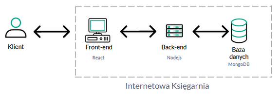

Strona internetowa księgarni składa się z:
- frontendu napisanego w bibliotece JavaScriptu jaką jest Reactjs
- backendu napisanego w Nodejs
- bazy danych, do tego celu wybrano MongoDB.

## Instalacja środowiska developerskiego
1. Pobierz i zainstaluj NodeJs ze strony nodejs.org.
2. Pobierz Visual Studio Code ze strony code.visualstudio.com.
3. Utwórz nowy folder.
4. W gitcie przejdź do nowo utworzonego folderu i wykonaj polecenie:
    git clone https://github.com/snix422/KsiegarniaInternetowa.git
5. Otworzyć w VSCode folder z projektem i w terminalu(skrót: Ctrl + Shift + `) wpisać komendę npm start.
6. Jeżeli wystąpiły błędy sprawdź czy posiadasz folder node_modules. Jeżeli nie usuń plik package-lock.json i wykonaj polecenie npm install w terminalu.
7. Po instalacji wykonaj polecenie npm start.
Środowisko pracy jest gotowe!

## Struktura bazy danych

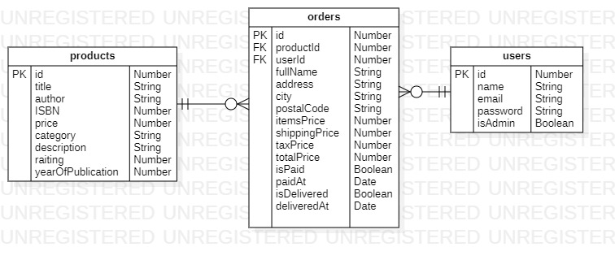

Zalogowany użytkownik dokonuje zamówienia. Może on dokonać większej liczby zamówień, jednak jedno zamówienie jest przypisane dokładnie do jednego użytkownika. To samo dotyczy książki występującej w kilku zamówieniach jednak każde zamówienie jest przypisane do jednej książki. Podobnie jest z autorami: jeden autor może posiadać kilka książek jednak jedna książka posiada dokładnie jednego autora.

Skróty:
* PK - oznacza klucz główny tabeli, czyli atrybut jednoznacznie określający każde wystąpienie danej encji.
* FK - oznacza klucz obcy, który wskazuje na klucz główny innej tabeli np. w tabeli books klucz obcy wskazuje na klucz główny z tabeli authors.

## Rejsetracja

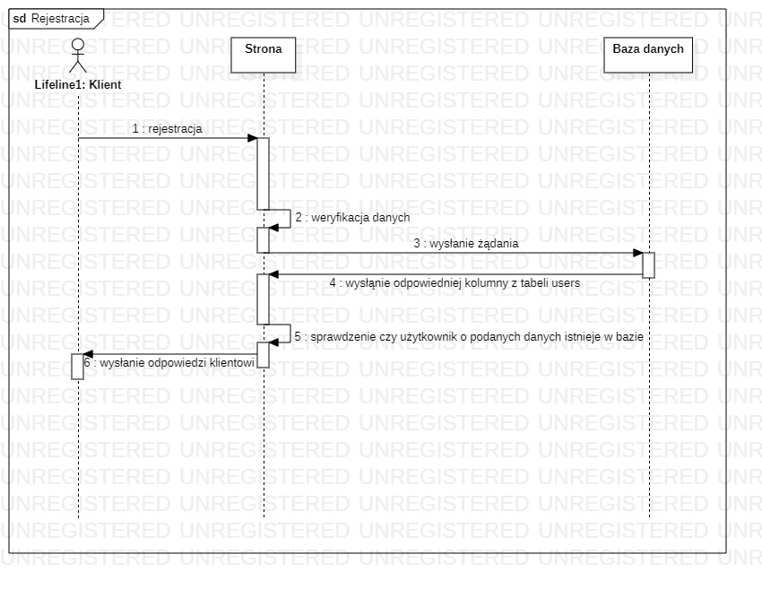

Klient wprowadza dane potrzebne do rejestracji w formularzu. Następnie po zatwierdzeniu danych, Strona dokonuje walidacji danych(sprawdzenie czy podany ciąg znaków w e-mailu to na pewno e-mail, długość podanego hasła). Po tej operacji wysyłane jest zapytanie do Bazy danych, czy znajduje się w niej użytkownik o podanych danych z formularza. Po tym sprawdzeniu Strona wysyła Klientowi odpowiedni komunikat.

## Logowanie

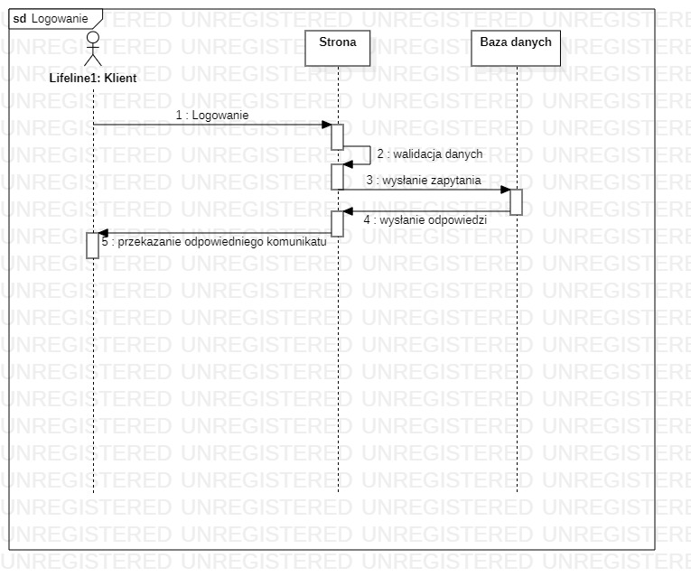

Klient wypełnia formularz jaki znajduje się na stronie logowania. Następnie wysłane przez Klienta dane są poddane walidacji, potem wysyłane jest zapytanie do Bazy danych czy istnieje użytkownik o podanych danych. Baza danych zwraca odpowiedź i w zależności od tej odpowiedzi Strona przekazuje Klientowi komunikat.
## Kod
### Server

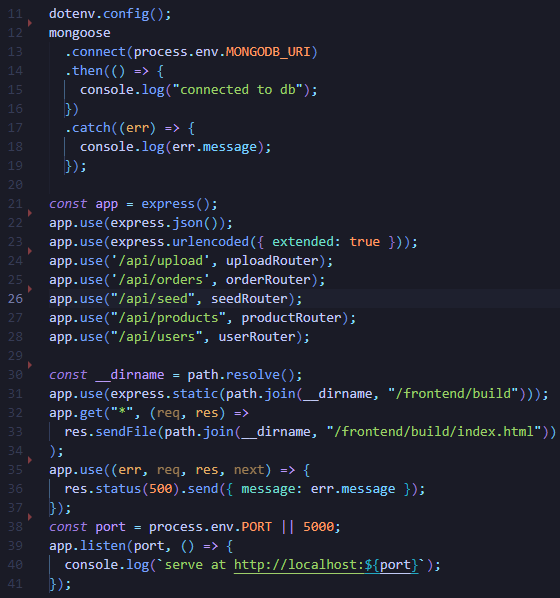

W liniach od 12 do 19 następuje połączenie z bazą danych(MongoDb). W liniach 22 i 23 następuje wywołanie wbudowanych funkcji middleware wbudowanych w expressJs.
Pierwsza z nich analizuje przychodzące żądania JSON i umieszcza przeanalizowane dane w właściowści req.body. Natomiast druga rozpoznaje nadchodzący obiekt żądania jako łańcuch znaków(string) lub tablicę. W liniach 24-28 przedstawiono jakie funkcje będą wywoływane gdy żądanie będzie zawierało określoną ścieżkę. Do zmiennej __dirname przypisywana jest bezwzględna ścieżka do bieżącego folderu. W linii 31 funkcja static znajduje i zwraca pliki statyczne z podanej ścieżki. W kolejnej linii za pomocą GET-a wysyłany jest plik index.html. Natomiast w linii 38 następuje przypisanie numeru portu(jeżeli nie jest przypisana żadna wartość do zmiennej środowiskowej przypisz zmiennej wartość 5000). Następnie funkcja listen wiąże i nasłuchuje połączeń na localhoscie.

### Utils

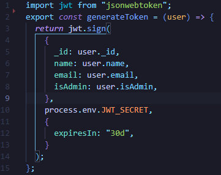

Tworzony jest token dla danego użytkownika, który jest ważny przez 30 dni. JWT(JSON Web Token) to standard za pomocą, którego przesyłane są informacje, w obiekcie JSON, między stronami. W liniach 5-8 znajdują się dane użytkownika, w linii 10 jest sekretny klucz/token potrzebny przy tworzeniu tokenu użytkownika a linia 12 to ustawienie opcji kiedy wygaśnie token.

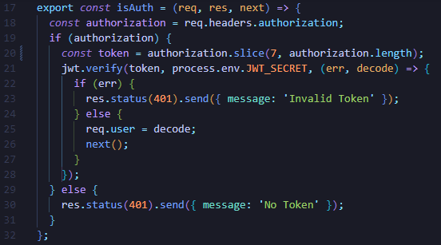

Do zmiennej authorization przekazywana jest wartość jaką zawiera nagłówek w sekcji authorization. Jeżeli authorization jest nullem zostanie wysłany komunikat o braku tokenu. W przeciwnym razie sprawdzany jest token jaki został przesłany w nagłówku. Jeżeli token jest błędny zwrócona zostanie odpowiednia informacja o błędzie, natomiast jeżeli token jest poprawny to do właściwości żądania(req.user) zostanie przypisana zakodowana wartość tokenu.

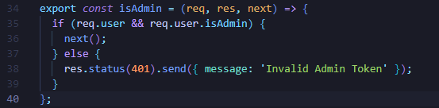

Sprawdzenie czy dany użytkownik posiada uprawnienia administratora, jeżeli nie zostanie wysłany odpowiedni komunikat. W przeciwnym wypadku następuje przejście do panelu administratora.

### SeedRouter

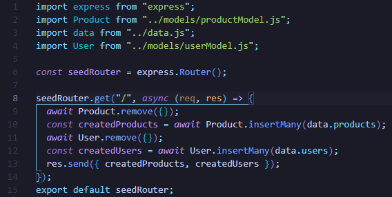

Gdy użytkownik otworzy stronę główną zostanie wykonana asynchroniczna funkcja, która w linii 9 oraz 11 usunie wcześniejsze rekordy produktów oraz użytkowników. Następnie utworzy tablice produktów i użytkowników(linie 10 i 12), które są wysyłane jako odpowiedź dla żądania.

### ProductRouter

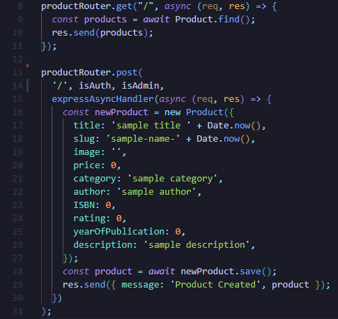

Podobnie jak w seedRouter.js po otworzeniu strony głównej(chodzi o metodę GET) wykona się asynchroniczna funkcja, która wyszuka wszystkie produkty i zapisze je do tablicy products, która następnie zostanie wysłana jako odpowiedź, by w seedRouter zostać usunięta.  Natomiast metoda POST dla strony głównej wykona funkcję tworzącą nowy produkt, jest ona dostępna tylko dla klientów posiadających konto w księgarni lub administratora.

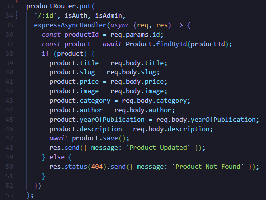

Metoda PUT wywołuje asynchroniczną funkcję, która wykonuje modyfikację produktu, którego id zostało podane jako parametr w URL. Jeżeli nie istnieje produkt o podanym id to zwracany jest komunikat o błędzie.

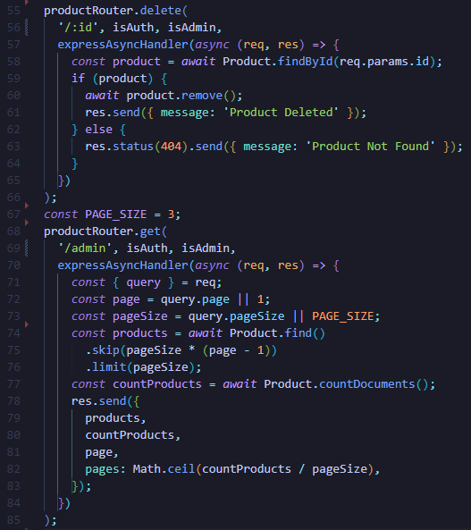

Metoda DELETE umożliwia, uprawnionym do tego użytkownikom, usunięcie produktu o podanym w parametrze numerze id. Natomiast metoda GET, wywołuje funkcję tworzącą listę produktów. Najpierw tworzy ona obiekt query na podstawie req(obiektu żądania) i przypisuje do stałych page i pageSize wartość odpowiednich pól obiektu query, jeżeli pole tego obiektu nie posiada żadnej wartości to do stałej przypisywana jest druga z możliwych wartości. Na przykład query.page nie posiada żadnej liczby to do stałej page przypisywana jest liczba 1.

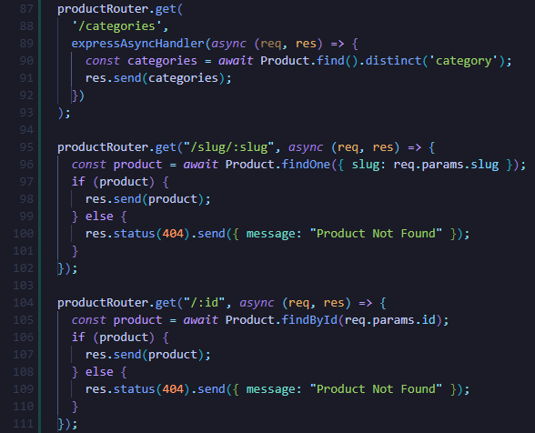

Jeżeli adres URL będzie zawierał “/slug/:slug” lub “/:id” to zostanie znaleziony, o ile istnieje w bazie danych, produkt a następnie wysłany jako odpowiedź, jeżeli nie istnieje produkt z danym id lub slug to zostanie wysłany komunikat informujący o braku takiego produktu. Metoda GET wyszuka wszystkie kategorie(dzięki funkcji distnict() kategorie zostaną wyszukane bez powtórzeń) dla pola “category” modelu Product.

### UserRouter

Metoda DELETE usuwa użytkownika jeżeli zostaną spełnione następujące warunki:
- id, które zostało przekazane jako parametr wskazuje na istniejącego w bazie danych użytkownika
- użytkownikiem, który ma być usunięty NIE jest administrator.

Jeżeli oba warunki są spełnione to po wykonaniu operacji usuwania użytkownika zwracany jest komunikat o wykonaniu operacji. Natomiast jeżeli jeden z tych warunków nie jest spełniony zwracany jest komunikat o błędzie.

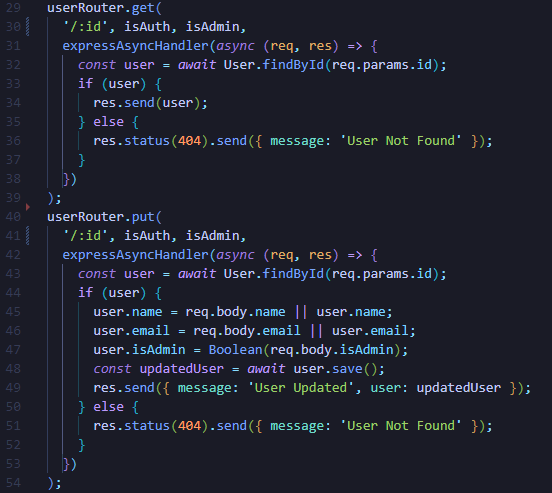

Metoda GET zwraca danego użytkownika, jeżeli podane id wskazuje na istniejącego w bazie danych użytkownika. Natomiast metoda PUT dokonuje modyfikacji wybranego użytkownika. Nowe wartości do odpowiednich pól użytkownika(linie 45-46) są przypisywane jeżeli istnieją one w req.body w przeciwnym wypadku pozostają stare dane.

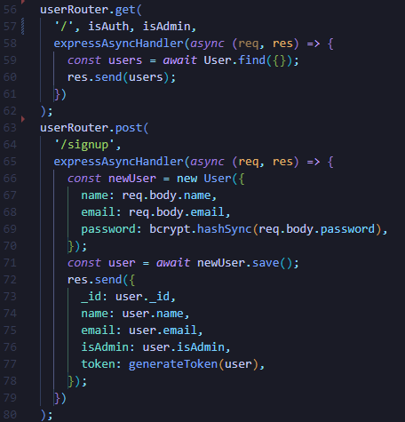

Metoda GET zwraca tablicę użytkowników, gdy w routingu pojawi się adres do strony głównej. Natomiast POST obsługuje operację rejestracji, tzn. tworzy obiekt newUser i wypełnia jego pola danymi podanymi przez klienta(hasło zostaje zahaszowane za pomocą bcrypt-a). Następnie jest on zapisywany do bazy danych, a jako odpowiedź(res) zostaje wysłany nowoutworzony użytkownik z wygenerowanym tokenem(linia 77).

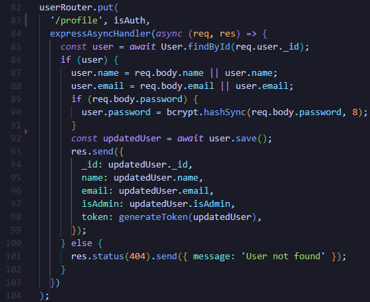

Za pomocą metody PUT zalogowany użytkownik może zaktualizować swój e-mail oraz nazwę(name).  Przy każdej aktualizacji danych generowany jest nowy token.

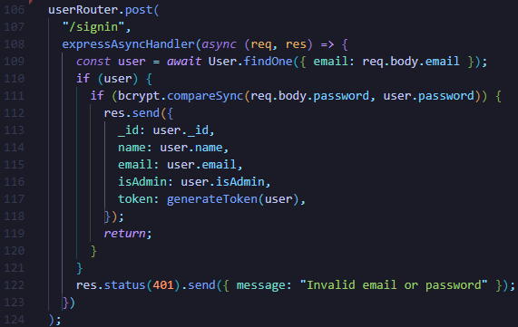

W POST następuje sprawdzenie czy e-mail, który podał użytkownik istnieje w bazie danych. Jeśli istnieje następnie jest sprawdzane hasło podane przez klienta z tym z bazy danych. Jeżeli użytkownik podał poprawne hasło oraz email to wysyłany jest obiekt zawierający dane na temat tego klienta(linie 16-20). W przeciwnym wypadku zostanie wysłany do użytkownika komunikat o niepoprawnym mailu lub haśle.

### OrderRouter

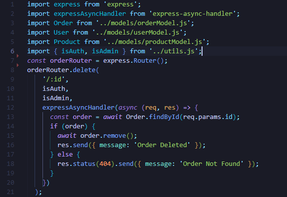

W momencie gdy użytkownik będzie chciał usunąć zamówienie to do orderRouter zostanie przesłany parametr :id z numerem indeksu danego zamówienia. Asynchroniczna funkcja najpierw sprawdzi czy istnieje zamówienie o takim indeksie, jeżeli nie to zwróci komunikat o błędzie w przeciwnym wypadku usunie zamówienie(linia 15) i zwróci komunikat o usuniętym zamówieniu.

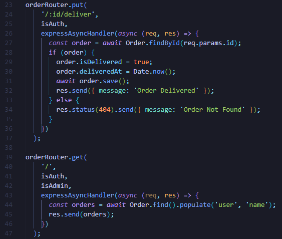

Pierwsza z pokazanych funkcji pozwoli zalogowanemu użytkownikowi na zmienienie informacji o dostarczonym zamówieniu. W pierwszej kolejności funkcja sprawdzi czy istnieje zamówienie o podanym id. Jeżeli nie to zwróci komunikat o błędzie w przeciwnym wypadku zmieni pole isDelivered z false na true a polu deliveredAt przypisze datę dostarczenia zamówienia. Potem zapisze zmiany jakie zaszły w zamówieniu i zwróci komunikat.
Natomiast druga funkcja, dla zalogowanego użytkownika lub administratora,  wyszuka w zamówieniach użytkowników i zwróci ich pola name.

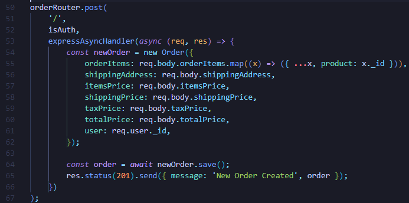

Gdy metoda POST otrzyma żądanie ze strony głównej od zalogowanego użytkownika, uruchomi funkcję z linii 53. Funkcja ta utworzy i zapisze nowe zamówienie na podstawie danych z żądania oraz zwróci komunikat o utworzeniu zamówienia.

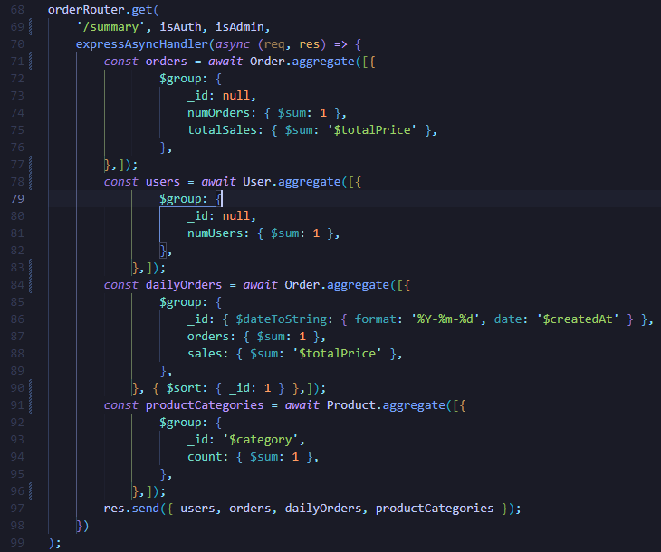

Metoda GET(dla administratora lub użytkownika posiadającego konto) w momencie gdy w pasku URL pojawi się “/summary” wykona “streszczenie”:
- zamówień(linie 71-76), które będzie zawierało liczbę zamówień oraz sumę cen wszystkich zamówień,
- użytkowników - zliczy liczbę klientów
- dziennych zamówień - oprócz podania liczby zamówień oraz sumy ich cen posortuje je rosnąco
- kategorii produktów.

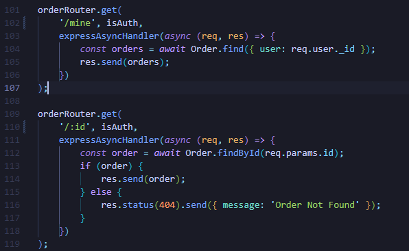

Pierwsza metoda GET zwróci zalogowanemu użytkownikowi wszystkie zamówienia jakie należą do niego. Natomiast druga metoda zwróci zamówienie o podanym id(jeżeli nie istnieje zamówienie o takim numerze indeksu zostanie zwrócony komunikat o błędzie).

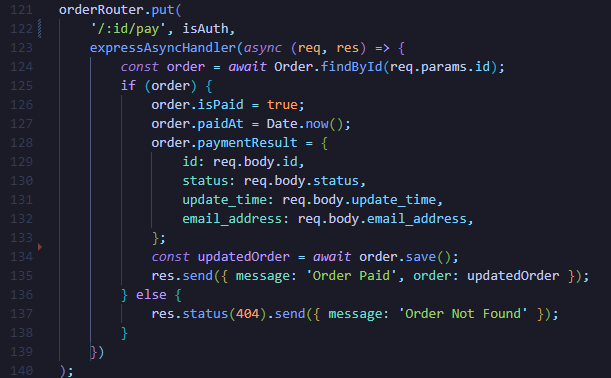

Gdy użytkownik będzie chciał zapłacić za zamówienie to metoda PUT sprawdzi czy istnieje zamówienie o podanym id, dla istniejącego zamówienia zmodyfikuje w następujący sposób pola: isPaid przypisze wartość true, paidAt przypisze datę, paymentResult uaktualni jego pola. Następnie zapisze modyfikacje danego zamówienia.

### UserModel i ProductModel

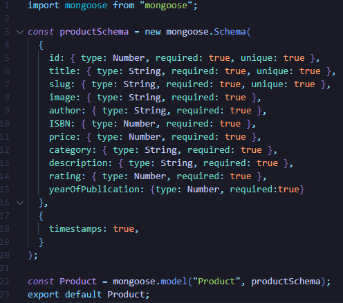
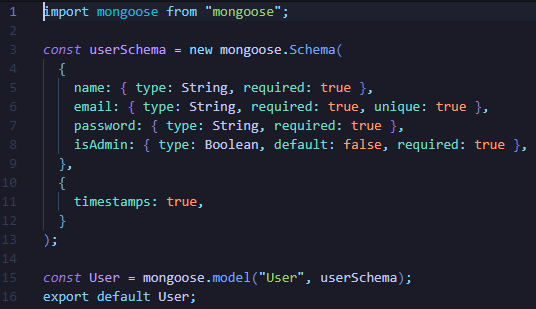

Za pomocą paczki mongoose został utworzony schemat użytkownika oraz produktu (schemat pozwala zdefiniować pola przechowywane w każdym dokumencie wraz z ich wymogami walidacji i wartościami domyślnymi). Następnie za pomocą tego schematu tworzony jest model User i Product. Oprócz określania, które pole jest wymagane można też określić jakie pola mają być unikalne oraz ustawiać wartości domyślne.

### OrderModel

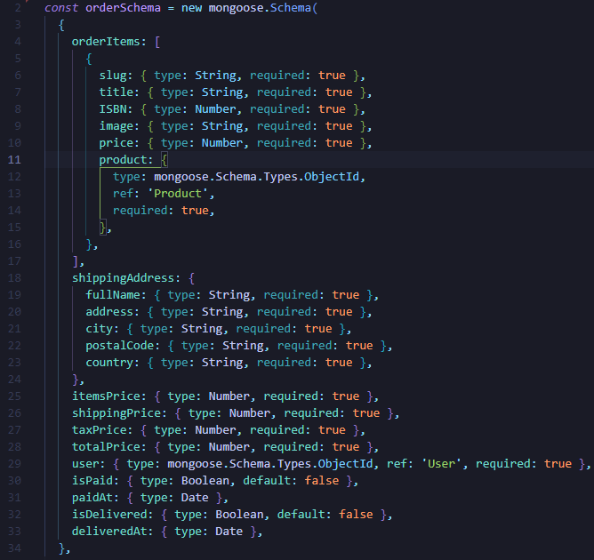
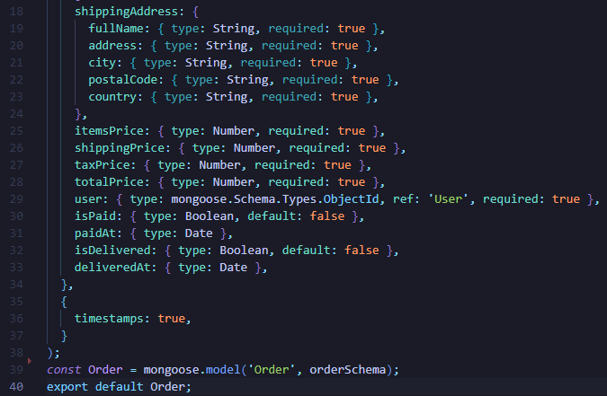

Model zamówienia zawiera dane produktu(linie 4-17), adresu zakupu(18-24) oraz ceny, kiedy dokonano zapłaty i który z użytkowników dokonał zamówienia.

&nbsp;&nbsp;
# 3. Dokumentacja użytkownika

## Logowanie do serwisu

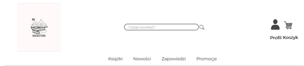

Po wejściu na stronę główną należy kliknąć na ikonę znajdującą się w prawym górnym rogu(tą z napisem “Profil”). Użytkownik zostanie przeniesiony do strony logowania(jak pokazano na poniższym screenie).

Jeżeli użytkownik posiada konto wystarczy, że wprowadzi login i hasło oraz kliknie przycisk “Zaloguj” aby uzyskać dostęp do niego. Jeżeli wprowadzone dane do logowania są błędne pojawi się odpowiedni komunikat(np.”Niepoprawny email”).

## Rejestracja
W przypadku gdy osoba nie posiada konta należy na stronie logowania kliknąć przycisk “Załóż konto” znajdujący się pod przyciskiem “Zaloguj”. W tym momencie zostanie wyświetlona strona przedstawiona na poniższym screenie

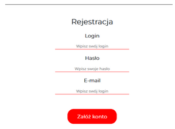

W tym momencie należy podać login(nazwa konta), hasło oraz e-mail a następnie kliknąć przycisk “Załóż konto”. Jeżeli wszystkie dane są poprawne to zostanie utworzone konto.
